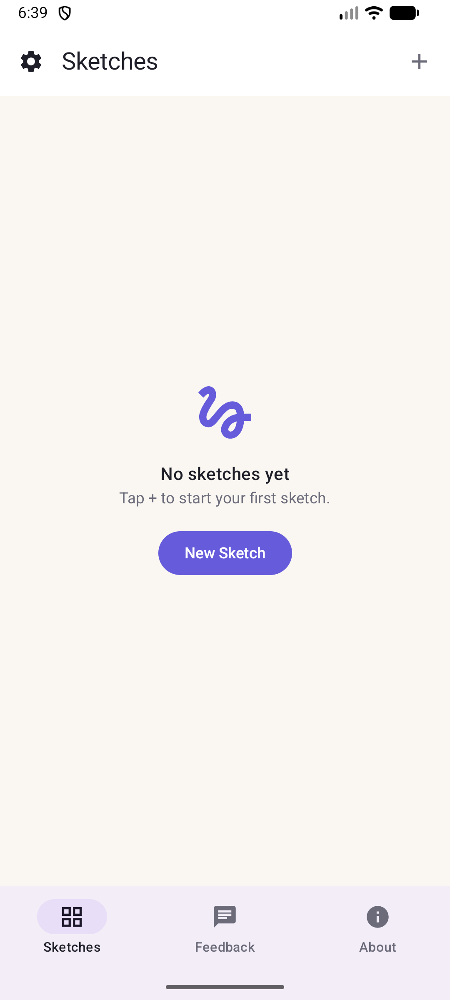
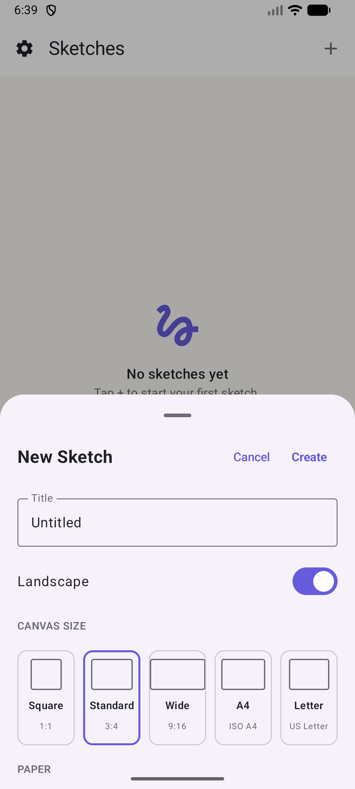
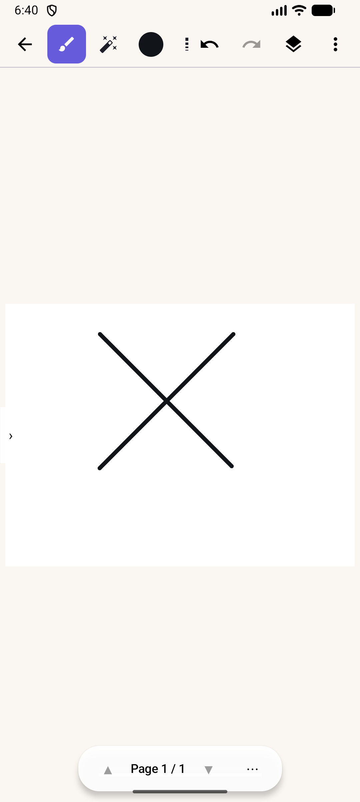

# Sketchbook Studio (Android)


A natural drawing studio for Android tablets and phones — the native Android
counterpart of the **Sketchbook Studio** iPad app. Sketch with pressure-sensitive
brushes and a stylus, work in layers, use symmetry and page templates, fill with
color, and apply adjustments and filter effects. Sketchbooks are multi-page and
autosave locally as JSON documents.

| Gallery | New Sketch | Editor |
|---|---|---|
|  |  |  |

## Features

- **20-brush library** in three categories (Inking / Sketching / Painting): Studio Pen,
  Fountain Pen, Monoline, Technical Pen, Gel Pen, Brush Pen, Pencil (with 6 graphite
  grades 2H–6B), Charcoal, Crayon, Chalk, Soft Pastel, Marker, Highlighter, Oil Paint,
  Gouache, Acrylic, Watercolor, Airbrush, Ink Bleed, and a **Stardust** particle brush.
- **Layers** — add, duplicate, reorder, rename, lock, hide, per-layer opacity, live
  thumbnails.
- **Multi-page sketchbooks** — pages sidebar with thumbnails, add/delete/clear pages,
  page navigation control.
- **Vector shapes** — rectangle, circle, triangle, diamond, star, pentagon, hexagon,
  arrow, heart, line; move / resize / rotate / flip before committing; optional color fill.
- **Flood fill** — scanline fill of enclosed areas (artwork-only boundary detection, so
  template lines never fence a fill).
- **Symmetry drawing** — vertical, horizontal, and quad mirror with dashed guides.
- **Adjustments & filters** — hue/saturation/brightness, colour balance, gaussian blur,
  noise, sharpen, mosaic; one-shot Mono / Sepia / Vibrant / Invert / Soft Blur effects.
- **8 page templates** — Blank, Ring File, Ruled, Grid, Dot Grid, Isometric, Storyboard,
  Music Staff, on white / cream / gray / black paper.
- **Canvas presets** — Square, Standard 3:4, Wide 9:16, A4, US Letter, portrait or landscape.
- **Gestures** — pinch to zoom (1–5×), two-finger pan, **two-finger tap = undo,
  three-finger tap = redo**; stylus always draws, finger drawing toggleable.
- **Undo/redo** — 30-step whole-document history covering strokes, fills, layer and
  page edits.
- Autosave (3 s debounce) + save on exit, with gallery thumbnails, favorites,
  duplicate and delete.

## Tech Stack

- **Kotlin 2.0** + **Jetpack Compose** (Material 3), single-activity architecture
- Custom drawing engine on `android.graphics` — vector stroke model with per-brush
  width/opacity/softness/pressure profiles, per-layer bitmap compositing, incremental
  stroke rendering
- **kotlinx.serialization** JSON documents (`.sketch` files in app-private storage)
- Min SDK 26 (Android 8.0) · Target SDK 35 · AGP 8.7 · Gradle 8.9

## Project Structure

```
app/src/main/java/com/sketchbook/app/
├── MainActivity.kt          # Root: Sketches / Feedback / About tabs
├── model/Models.kt          # SketchDocument, Page, Layer, Stroke, brushes, presets
├── data/                    # DocumentStore (JSON persistence), AppSettings
├── drawing/                 # BrushRenderer, LayerCompositor, TemplateRenderer,
│                            # FloodFill, ShapeFactory, Adjustments
└── ui/
    ├── gallery/             # Gallery grid + New Sketch sheet
    ├── editor/              # EditorScreen, EditorViewModel, panels & pickers
    ├── settings/            # Settings sheet
    ├── about/               # About + WhatsApp feedback
    └── theme/               # Material 3 theme (brand indigo/teal/amber)
```

## Build & Run

```bash
# Debug build
./gradlew :app:assembleDebug

# Signed release bundle (requires keystore.properties + upload-keystore.jks, not in git)
./gradlew :app:bundleRelease
```

Open in Android Studio (Ladybug+) or install the debug APK:

```bash
adb install app/build/outputs/apk/debug/app-debug.apk
```

Signing files (`keystore.properties`, `upload-keystore.jks`) and `local.properties`
are intentionally gitignored — supply your own for release builds.

## Related

- iOS/iPadOS version: **Sketchbook Studio** on the App Store
  (`com.tertiaryinfotech.sketchbookapp`).

## Developer

**Tertiary Infotech Academy Pte. Ltd.** — [tertiaryinfotech.com](https://www.tertiaryinfotech.com)

Feedback via WhatsApp: [+65 8866 6375](https://wa.me/6588666375)
